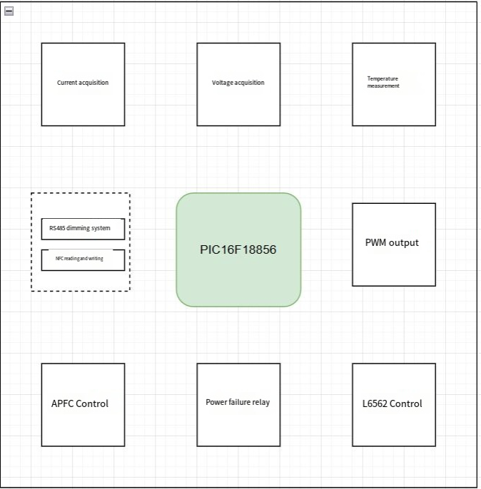
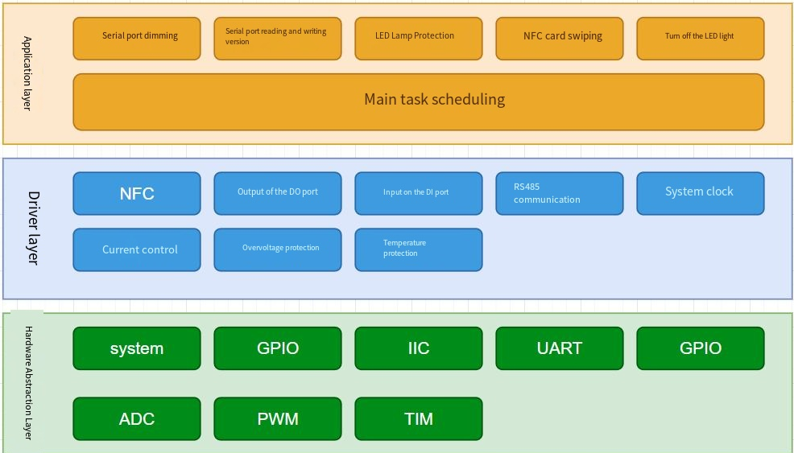

# Driver Software Requirements Analysis

| Product Name | LD-1CH-PIC16F18856-T-V1.0 |
|---------|--------------------------|
| Document Version | V1.0 |
| Department | Product Engineering Center |
| Author | Wang Tiannan |
| Creation Date | November 20, 2025 |

| **Version No.** | **Reviser** | **Revision Date** | **Revision Description**                                                                 |
|------------|------------|--------------|------------------------------------------------------------------------------|
| V1.0       | Wang Tiannan     | 2025/11/20   | 1. Define project background 2. Define resource allocation 3. Define software architecture 4. Define protection requirements 5. Define RS485 communication requirements 6. Define NFC read/write rules 7. Define dimming control |

## 1. Overview

### 1.1 Project Background

This LED constant-current driver is used for agricultural lighting equipment and requires high reliability, remote communication/configuration, and multiple protection functions. The system uses an MCU to control constant current output, supports RS485 communication with a host, and supports NFC parameter configuration and command calibration.

## 2. System Functions

### 2.1 System Framework

## 3. Hardware Resource Allocation

| MCU Resources      | Purpose                   | Notes               |
|-----------------|------------------------|--------------------|
| MCU             | PIC16F18856            | Main controller               |
| ADC Sampling         | Voltage/Current/Temperature sampling     | 10-bit resolution           |
| PWM             | Control LED output current        | PWM digital output        |
| UART            | RS485 serial communication          | 9600 bps            |
| NFC Read/Write         | Configure basic parameters           | I2C interface            |
| GPIO            | Protection detection / control outputs      | Multiple outputs/inputs  |

## 4. Software Design

### 4.1 Software Architecture Design

### 4.2 Main Software Flow

1. System power-on initialization  
2. Read current value and version information stored in NFC  
3. Initialize RS485 communication and wait for data  
4. Loop and execute each task module:  
   - Voltage, current, temperature sampling  
   - Input over/under-voltage protection  
   - Output short-circuit, open-circuit, over-voltage, under-voltage protection  
   - Temperature protection  
   - RS485 communication parsing  
   - Dimming output control

## 5. Functional Modules

### 5.1 NFC Read/Write Storage Design

| **Requirement Name** | **NFC Read/Write**                                                       |
|--------------|-------------------------------------------------------------------|
| Requirement Description     | 1. Initialize the NFC module 2. Read data and length from the specified NFC address 3. Write data and length to the specified NFC address Note: After NFC power-up it can store current values, version information, etc., which can be read/written by software. |

### 5.2 RS485 Parsing Design

#### Dimming Commands

| **Requirement Name** | **Dimming Commands**                                                    |
|--------------|----------------------------------------------------------------|
| Requirement Description     | According to the rs_485_private_protocol.PDF command set description On serial interrupt, store each received byte into a buffer (double buffer to prevent data conflict) Parse RS485 frame header + length + data + checksum Parse the last two bytes CRCL[16], CRCH[17] and validate Read dimming ratio value to control lighting |

#### Read/Write Version Information

| **Requirement Name** | **Read/Write Version Information**                                                |
|--------------|----------------------------------------------------------------|
| Requirement Description     | On serial interrupt, store each received byte into a buffer Parse RS485 frame header[0] + address[1] Parse the last two bytes CRCL[16], CRCH[17] and validate Check function code[3] Check read/write flag[2] Logic and data processing [...] Clear buffer |

### 5.3 Voltage and Temperature Protection Design

#### Input Protection

| **Requirement Name** | **Input Protection**                                                                                     |
|--------------|-------------------------------------------------------------------------------------------------|
| Requirement Description     | 1. If input voltage > 260 VAC, allow lamp on once. 2. If input voltage > 280 VAC, normal lamp on. 3. Input undervoltage protection stage 1 (VIN < 295 VAC) reduce power. 4. Input undervoltage protection stage 2 (VIN < 280 VAC) after 3 seconds shut down PWM, disable L6562, open relay. 5. Input undervoltage recovery (VIN > 310 VAC) |

#### Output Protection

| **Requirement Name** | **Output Protection**                                                                 |
|--------------|-----------------------------------------------------------------------------|
| Requirement Description     | 1. Output undervoltage protection (VOUT < 150 VDC): after 1s shut down PWM, disable L6562, open relay 2. Output overvoltage protection: after 1s shut down PWM, disable L6562, open relay 3. Output short-circuit protection (after 400 ms) 4. Output open-circuit protection (after 5 s) 5. Over-power protection (power > 802 W) |

#### Temperature Protection

| **Requirement Name** | **Temperature Protection**                                                                               |
|--------------|-------------------------------------------------------------------------------------------|
| Requirement Description     | 1. Over-temperature protection stage 1 (TC > 75°C) reduce power (recover when TC < 67.5°C) 2. Over-temperature protection stage 2 (TC > 85°C) shut down PWM, disable L6562, open relay, reduce power (recover when TC < 76.5°C) 3. Temperature recovery (TC < 67.5°C) 4. 12-bit ADC, median averaging |

### 5.4 Dimming Control

| **Requirement Name** | **PWM Dimming Control**                                                                                          |
|--------------|----------------------------------------------------------------------------------------------------------|
| Requirement Description     | 1. Control current via PWM output (0-1023 resolution) 2. Support dimming range 0x14-0xFF 3. Smooth dimming transition: fast step = 5, fine step = 1 4. Support RS485 remote dimming 5. Support NFC local dimming 2. Current values obtained from NFC per LED_NFC configuration document 3. Calibration via RS485 according to rs_485_private_protocol.PDF command specification |

## 6. References

1. RS485 Private Communication Protocol Specification.pdf  
2. LED_NFC Configuration Specification.pdf  
3. PIC16F18856 Data Sheet